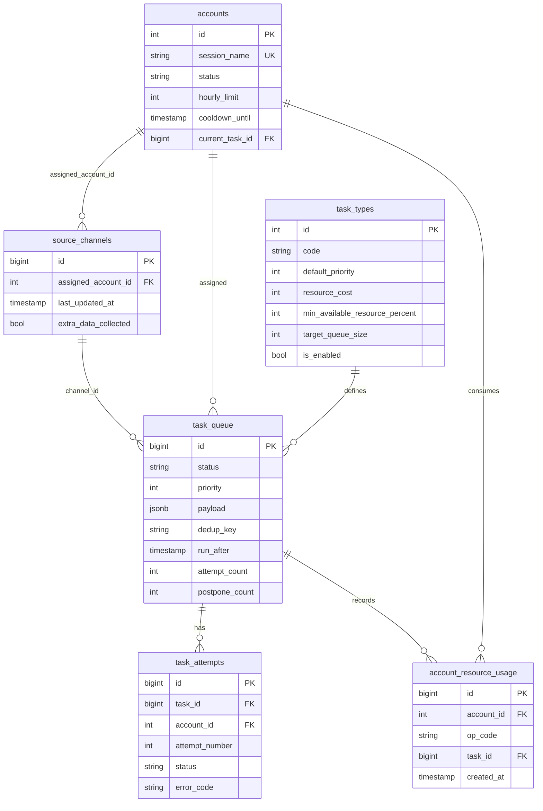
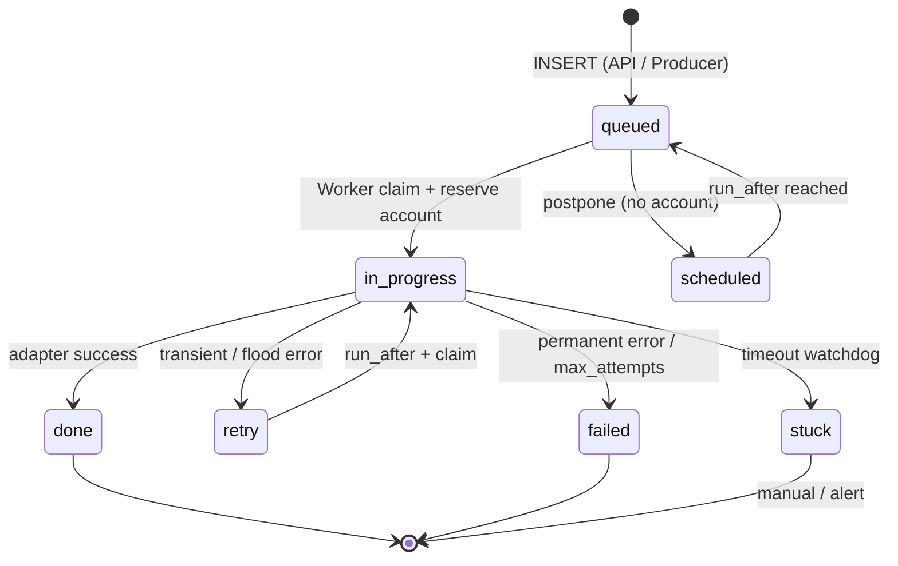
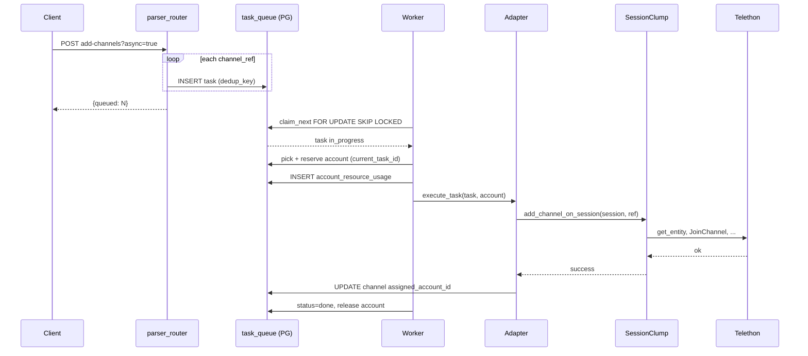
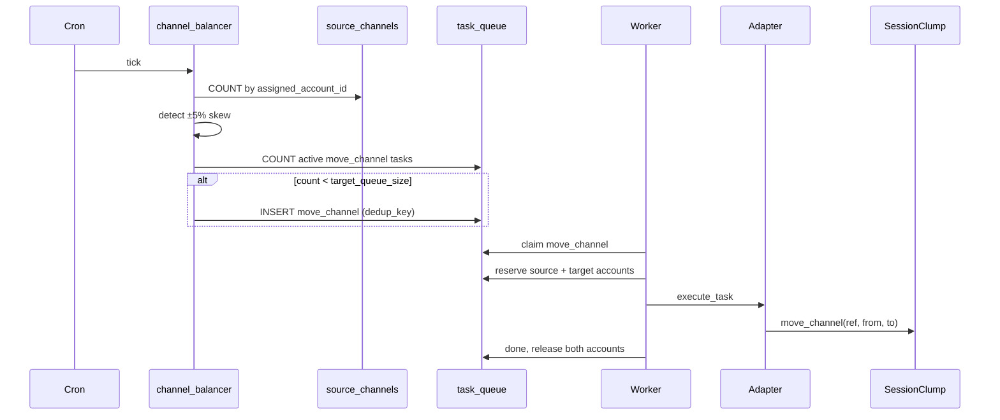
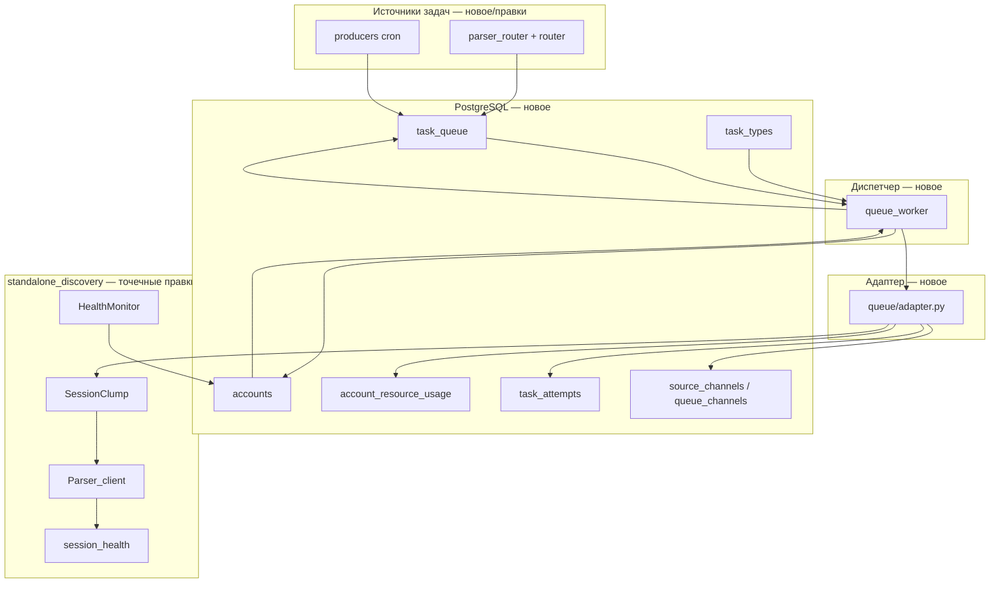

# План реализации ТЗ «Load Balancer for Telegram Channels»

**Дата:** 2026-06-07  
**Принцип:** минимальные изменения в `standalone_discovery` — не переписывать `SessionClump`, а добавить PG-слой (очередь + диспетчер + адаптер) поверх существующего Telethon-исполнения.  
**Прототип `queue_prot_blance`:** справочник (`ops_catalog`, логирование), не production-очередь.  
**Сопоставление с текущим кодом:** `[diff-tz-vs-standalone-discovery.md](diff-tz-vs-standalone-discovery.md)`

---

## 1. Цель и границы

### 1.1. Что строим

Платформенную доменную очередь в PostgreSQL по ТЗ:

- атомарные задачи по каналам;
- резервирование аккаунтов (`current_task_id`, cooldown, hourly_limit);
- worker-диспетчер с `FOR UPDATE SKIP LOCKED`;
- адаптер между очередью и `SessionClump`;
- продюсеры фоновых задач;
- мониторинг и обработка ошибок.

### 1.2. Что не переписываем


| Компонент                            | Действие                                                      |
| ------------------------------------ | ------------------------------------------------------------- |
| `SessionClump` supervisor / listener | Оставить; добавить 2 метода «выполнить на конкретной session» |
| `migrate_channels`, `rebalance_idle` | Оставить для аварий; доменный ±5% — через PG-продюсер         |
| Контур `/discover`, scorer           | Не менять логику поиска                                       |
| `queue_prot_blance/` (Huey mock)     | Не переносить в production                                    |


### 1.3. MVP vs полное ТЗ

**MVP (~4 недели)** — сквозной контур:

1. PG-схема + seed `task_types` для `parser_add_channel`, `move_channel`
2. Worker-диспетчер: claim → reserve account → adapter → done/fail/retry/postpone
3. Адаптер `execute_task(task, account)`
4. Один API-эндпойнт через feature flag (`USE_PG_QUEUE`)
5. Flood → `accounts.cooldown_until` в PG

**После MVP** — продюсеры, полный RPH per-op, идемпотентность multi-op, удаление `action_queue`, мониторинг.

---

## 2. Целевая архитектура

```
[Источники задач]                    [PG — источник истины]              [Исполнение — существующий код]
                                                                         
Продюсеры (cron)  ──INSERT──►  task_types ◄── настройки                    
API (HTTP)        ──INSERT──►  task_queue                                  
                               accounts ◄──────── HealthMonitor (cooldown) 
                               account_resource_usage                      
                               task_attempts                                 
                                      │                                    
                                      ▼                                    
                               Worker-Диспетчер                            
                               (claim, reserve, postpone)                  
                                      │                                    
                                      ▼                                    
                               queue/adapter.py (execute_task)             
                                      │                                    
                                      ▼                                    
                               SessionClump / Parser_client (Telethon)     
```

### 2.1. Разделение ответственности


| Слой                 | Ответственность                                        | Новый код                                                |
| -------------------- | ------------------------------------------------------ | -------------------------------------------------------- |
| **Продюсеры / API**  | Создают строки в `task_queue`, не выполняют Telethon   | `scripts/producers/`, правка `parser_router.py`          |
| **Worker-Диспетчер** | Выбор задачи, резерв аккаунта, жизненный цикл статусов | `queue_worker.py`, `queue/repos/`                        |
| **Адаптер**          | Маппинг `task_type` → вызов clump; ошибки → retry/fail | `queue/adapter.py` (заполнить `queue_prot.py` или рядом) |
| **SessionClump**     | Telethon: add, migrate, listen                         | +2 метода, hook flood→PG                                 |


---

## 3. Размещение нового кода


| Компонент                          | Путь                                                     |
| ---------------------------------- | -------------------------------------------------------- |
| Миграции SQL                       | `standalone_discovery/migrations/`                       |
| PG-репозитории, диспетчер, адаптер | `standalone_discovery/discovery_api/queue/`              |
| Точка входа worker                 | `standalone_discovery/discovery_api/queue_worker.py`     |
| Продюсеры                          | `standalone_discovery/scripts/producers/`                |
| Env                                | `QUEUE_DATABASE_URL`, `USE_PG_QUEUE`, `RUN_QUEUE_WORKER` |


**Не расширять** `session_registry.py` логикой очереди — только точечные методы и sync cooldown.

---

## 4. Фазы реализации (подробно)

### Фаза 0. Подготовка (0.5 недели)

#### 0.1. Зафиксировать контракты

- DSN PostgreSQL (`QUEUE_DATABASE_URL`)
- Список task types для MVP: `parser_add_channel`, `move_channel`
- Feature flags: `USE_PG_QUEUE`, `QUEUE_GRANULAR_RPH`, `REBALANCE_IDLE_ENABLED`
- Решение по таблице каналов: `source_channels` в основной БД или staging `queue_channels` до интеграции

#### 0.2. Зависимости

- `asyncpg` или `psycopg[pool]` (async)
- Обновить `standalone_discovery/requirements.txt`

#### 0.3. Критерий выхода

- ADR/соглашение по путям и env зафиксировано в этом документе
- Docker-compose (опционально): второй сервис `queue-worker`

---

### Фаза 1. Схема PostgreSQL (1 неделя)

#### 1.1. `task_types`

Настройки типов задач в БД (§8 ТЗ). Поля MVP:

- `code`, `name`, `is_enabled`
- `default_priority`, `resource_cost`
- `source_resource_cost`, `target_resource_cost`, `uses_two_accounts`
- `min_available_resource_percent`
- `max_attempts`, `retry_delay_seconds`, `retry_backoff_multiplier`, `max_retry_delay_seconds`
- `target_queue_size`, `max_postpone_count`, `task_timeout_seconds`

**Seed MVP:**


| code                 | priority | resource      | min_available_% | target_queue_size | enabled |
| -------------------- | -------- | ------------- | --------------- | ----------------- | ------- |
| `parser_add_channel` | 500      | 1             | 80              | —                 | true    |
| `move_channel`       | 100      | 1+1 (src/tgt) | 80              | 20                | true    |
| `update_channel`     | 50       | 1             | 90              | 20                | false   |
| `collect_extra_data` | 200      | 1             | 90              | 20                | false   |


#### 1.2. `accounts`

Поля: `id`, `session_name` (UNIQUE), `status`, `hourly_limit`, `is_enabled`, `cooldown_until`, `current_task_id`, `last_used_at`, `last_error`, `last_error_at`.

**Миграция данных:**

1. UPSERT из SQLite `telegram_accounts` (`session_name`, метаданные)
2. UPSERT session names из активных clump'ов
3. `admin_blocked` → `status = disabled`
4. `hourly_limit` — env-дефолт (например 100)

SQLite `account_store` **не удалять** на MVP — sync в worker.

#### 1.3. `task_queue`

Ключевые поля: `task_type_id`, `task_type_code`, `status`, `priority`, `channel_id`, `account_id`, `source_account_id`, `target_account_id`, `payload` (JSONB), `dedup_key`, `run_after`, `locked_by/at/until`, `attempt_count`, `postpone_count`, `max_attempts`, `last_error`, timestamps, `created_by`.

**Индексы:**

- `(status, run_after, priority DESC, created_at)` — диспетчер
- Partial unique: `dedup_key` WHERE status IN (`queued`, `scheduled`, `retry`, `in_progress`)

**Payload `parser_add_channel`:**

```json
{
  "parser_id": "p1",
  "channel_ref": "@channel",
  "webhook_url": "https://..."
}
```

#### 1.4. `account_resource_usage`

`id`, `account_id`, `op_code`, `task_id`, `created_at`. Индекс `(account_id, created_at)`.

MVP: одна запись `op_code='task'` при старте выполнения. Позже — per-op (`get_entity`, `JoinChannel`, …).

#### 1.5. `task_attempts`

`id`, `task_id`, `account_id`, `attempt_number`, `status`, `error_code`, `started_at`, `finished_at`.

#### 1.6. Таблица каналов

Если доступна `source_channels`:

- `assigned_account_id`, `last_updated_at`, `extra_data_collected`

Иначе staging `queue_channels(channel_ref, assigned_account_id, extra_data_collected, last_updated_at)`.

#### 1.7. Репозитории

- `queue/db.py` — pool, транзакции
- `queue/repos/task_types.py`
- `queue/repos/task_queue.py` — enqueue, claim, complete, fail, retry, postpone
- `queue/repos/accounts.py` — pick, reserve, release, cooldown, sync from SQLite
- `queue/repos/resource_usage.py`
- `queue/repos/task_attempts.py`

Raw SQL на MVP, без ORM.

#### 1.8. Критерий выхода

- Миграции применяются на чистой БД
- Unit-тесты репозиториев: insert, claim, reserve, dedup conflict

---

### Фаза 2. Worker-Диспетчер (1–1.5 недели)

#### 2.1. Процесс

Отдельный asyncio-процесс: `python -m discovery_api.queue_worker`.

Не встраивать в FastAPI lifespan (кроме dev-флага).

#### 2.2. Главный цикл

1. `claim_next_task(worker_id)` — `SELECT … FOR UPDATE SKIP LOCKED`, `status → in_progress`
2. Если задача с `account_id` / `source+target` — резерв указанных аккаунтов
3. Иначе `pick_and_reserve_account(task)` — least-loaded + resource check
4. Нет аккаунта → `postpone` (+5 min, `postpone_count++`, `status=scheduled`)
5. `adapter.execute_task(task, account(s))`
6. Success → `done`; typed errors → `retry` / `failed`
7. `release_account` в `finally`

#### 2.3. Выбор аккаунта

Условия:

- `status = active`, `is_enabled`, `cooldown_until <= now()`, `current_task_id IS NULL`
- `available_percent = (hourly_limit - used_last_hour) / hourly_limit * 100 >= min_available_resource_percent`
- Сортировка: min usage за час (MVP) или min каналов на аккаунте

`move_channel`: атомарный резерв **двух** аккаунтов в одной транзакции.

#### 2.4. Watchdog (минимальный)

Периодически: `in_progress` старше `task_timeout_seconds` → `stuck`.

#### 2.5. Критерий выхода

- Integration test: mock adapter, задачи проходят queued → in_progress → done
- Postpone при отсутствии аккаунта не блокирует следующую задачу
- SKIP LOCKED работает при двух worker-процессах

---

### Фаза 3. Адаптер и интеграция с SessionClump (1.5 недели)

#### 3.1. Адаптер `execute_task`

Файл: `discovery_api/queue/adapter.py` (или заполнить `queue_prot.py` re-export'ом).

```python
async def execute_task(task, accounts, *, clump_registry) -> None: ...
```

Ветки:


| task_type            | Действие                                              |
| -------------------- | ----------------------------------------------------- |
| `parser_add_channel` | `clump.add_channel_on_session(session, ref, webhook)` |
| `move_channel`       | `clump.move_channel(ref, from_session, to_session)`   |


#### 3.2. Минимальные правки SessionClump

**Добавить** (не переписывать `_pick_target`):

- `add_channel_on_session(session_name, channel_ref, webhook_url)` — без `_pick_target`
- `move_channel(channel_ref, from_session, to_session)` — один канал

HTTP/sync пути продолжают использовать `_pick_target` до фазы 6.

#### 3.3. Учёт ресурса

- При старте execute: `INSERT account_resource_usage(account_id, op_code='task', task_id)`
- Опционально (`QUEUE_GRANULAR_RPH=1`): hook в resolve/join → insert с `op_code`

#### 3.4. HealthMonitor → PG

После `mark_flood(secs)`: `accounts_repo.set_cooldown(session_name, until, status='cooldown')`.  
После ban: `status='banned'`.

#### 3.5. Перевод API

`POST /parser/{id}/add-channels?async=true`:

- `USE_PG_QUEUE=true` → N × `INSERT task_queue` (по одному каналу)
- иначе → старый `action_queue`

#### 3.6. Dual-write каналов

После успешного add: UPDATE `assigned_account_id` в PG + существующий JSON persistence clump.

#### 3.7. Критерий выхода

- Async add-channels через PG end-to-end на staging
- Flood на сессии блокирует аккаунт в PG и задача уходит в retry
- Feature flag off — регрессий нет

---

### Фаза 4. Ошибки и идемпотентность (1 неделя)

#### 4.1. Классификация

Использовать `classify_telethon_error` из `session_health.py`:


| Kind      | Действие                                            |
| --------- | --------------------------------------------------- |
| flood     | cooldown в PG, task → retry, `run_after += seconds` |
| banned    | account → banned, task → failed или re-queue        |
| transient | retry + backoff из `task_types`                     |
| fatal     | failed, `last_error`                                |


Адаптер пробрасывает `RetryableError` / `PermanentError`; supervisor не менять.

#### 4.2. task_attempts и last_error

- INSERT attempt в начале execute
- UPDATE в конце
- `task_queue.last_error` — код для мониторинга

#### 4.3. Идемпотентность multi-op

Для задач с пайплайном ops (`collect_extra_data` и др.):

- `payload.last_completed_step`
- Каталог ops — из `queue_prot_blance/ops_catalog.py` как данные
- При retry — пропуск выполненных шагов

Для MVP single-op (`parser_add_channel`) — достаточно dedup clump по `allowed_chat_ids`.

#### 4.4. Критерий выхода

- Retry с backoff после transient
- `attempt_count` и `task_attempts` согласованы
- Multi-op идемпотентность — тест на одном типе задачи

---

### Фаза 5. Продюсеры и мониторинг (1.5 недели)

#### 5.1. `channel_balancer` (cron)

1. COUNT каналов GROUP BY `assigned_account_id`
2. avg; outliers за ±5%
3. INSERT `move_channel` до `target_queue_size`, с `dedup_key`
4. `created_by = 'channel_balancer'`

Env: при включённом PG balancer рассмотреть `REBALANCE_IDLE_ENABLED=false`.

#### 5.2. `collect_extra_data` (cron)

1. Каналы с `extra_data_collected = false` и `assigned_account_id IS NOT NULL`
2. INSERT до `target_queue_size`, priority 200
3. Новая ветка адаптера: scorer / `iter_messages`

#### 5.3. `update_channel` (cron)

1. Каналы с `last_updated_at` старше порога (продуктовая логика)
2. INSERT до `target_queue_size`, priority 50

#### 5.4. Мониторинг

- SQL views / `GET /queue/metrics`: `queue_size_by_status`, `oldest_queued_age`, `stuck_count`, `accounts_without_resource`, `postpone_count` high
- Алерты (лог / webhook) при порогах из `task_types.max_postpone_count`

#### 5.5. Критерий выхода

- Три продюсера создают задачи без дублей (dedup)
- Метрики доступны; stuck watchdog срабатывает

---

### Фаза 6. Cleanup (0.5 недели)

1. Удалить `action_queue.py`, переписать тесты на PG
2. Deprecate in-memory `_add_timestamps` → проверка PG (env flag)
3. Все HTTP bulk-пути → PG; `_pick_target` только для legacy/rebalance
4. Включить `task_types` для `update_channel`, `collect_extra_data`

---

## 5. Карта изменений по файлам


| Файл                                                     | Изменение                           |
| -------------------------------------------------------- | ----------------------------------- |
| `standalone_discovery/migrations/*.sql`                  | **Новое**                           |
| `standalone_discovery/discovery_api/queue/`**            | **Новое**                           |
| `standalone_discovery/discovery_api/queue_worker.py`     | **Новое**                           |
| `standalone_discovery/scripts/producers/*.py`            | **Новое**                           |
| `standalone_discovery/discovery_api/session_registry.py` | +2 метода, flood→PG (~50–80 строк)  |
| `standalone_discovery/discovery_api/parser_router.py`    | feature flag (~30 строк)            |
| `standalone_discovery/discovery_api/queue_prot.py`       | re-export адаптера или thin wrapper |
| `standalone_discovery/requirements.txt`                  | asyncpg/psycopg                     |
| `standalone_discovery/docker-compose.yml`                | опционально: queue-worker service   |
| `action_queue.py`                                        | удалить на фазе 6                   |
| `queue_prot_blance/`*                                    | не трогать                          |


---

## 6. Риски


| Риск                            | Митигация                                                                |
| ------------------------------- | ------------------------------------------------------------------------ |
| Listener vs `current_task_id`   | Резерв только на время `execute_task` (секунды); listener не держит lock |
| JSON clump vs PG                | Dual-write из адаптера                                                   |
| Дублирование с `rebalance_idle` | Env-переключатель                                                        |
| Нет `source_channels` в PG      | Staging `queue_channels`                                                 |
| Два учёта RPH                   | MVP: только PG; потом отключить `_add_timestamps`                        |


---

## 7. Оценка сроков


| Блок                 | Срок         |
| -------------------- | ------------ |
| Фаза 0–1             | 1 нед        |
| Фаза 2               | 1–1.5 нед    |
| Фаза 3 (MVP)         | 1.5 нед      |
| **MVP итого**        | **~4 нед**   |
| Фазы 4–6 (полное ТЗ) | +3–4 нед     |
| **Полное ТЗ**        | **~7–8 нед** |


---

## 8. Критерии готовности

### MVP

- [ ] Async add-channels → N задач в PG → worker → clump
- [ ] Postpone при нехватке аккаунта
- [ ] Flood → cooldown в PG + retry задачи
- [ ] dedup_key без дублей активных задач
- [ ] `USE_PG_QUEUE=false` — без регрессий

### Полное ТЗ

- [ ] Все таблицы §3–§9 ТЗ
- [ ] Все статусы задач и retry/postpone/stuck
- [ ] Гранулярный RPH per op
- [ ] Три продюсера + target_queue_size
- [ ] move_channel с dual reserve
- [ ] Идемпотентность multi-op
- [ ] Мониторинг и алерты §26
- [ ] action_queue удалён; API только через task_queue

---

## 9. Задачи для закрытия ТЗ

Ниже — атомарные задачи (issue-ready). Зависимости: номер блока → после предыдущих в том же блоке и указанных «deps».

### Блок A. Инфраструктура и схема


| ID  | Задача                                                               | Deps | Фаза |
| --- | -------------------------------------------------------------------- | ---- | ---- |
| A1  | Добавить `QUEUE_DATABASE_URL`, документировать env в `.env.example`  | —    | 0    |
| A2  | Подключить async PG driver в `requirements.txt`                      | A1   | 0    |
| A3  | Миграция: создать `task_types`                                       | A2   | 1    |
| A4  | Миграция: создать `accounts`                                         | A2   | 1    |
| A5  | Миграция: создать `task_queue` + индексы + partial unique dedup      | A3   | 1    |
| A6  | Миграция: создать `account_resource_usage`                           | A4   | 1    |
| A7  | Миграция: создать `task_attempts`                                    | A5   | 1    |
| A8  | Миграция: расширить `source_channels` или создать `queue_channels`   | A4   | 1    |
| A9  | Seed SQL: `task_types` (4 типа, 2 enabled)                           | A3   | 1    |
| A10 | Скрипт начальной синхронизации `accounts` из SQLite + clump sessions | A4   | 1    |


### Блок B. Репозитории


| ID  | Задача                                                            | Deps   | Фаза |
| --- | ----------------------------------------------------------------- | ------ | ---- |
| B1  | `queue/db.py`: pool, транзакции, healthcheck                      | A2     | 1    |
| B2  | `repos/task_types.py`: get by code, list enabled                  | B1, A3 | 1    |
| B3  | `repos/task_queue.py`: enqueue с dedup                            | B1, A5 | 1    |
| B4  | `repos/task_queue.py`: claim_next (SKIP LOCKED)                   | B3     | 1    |
| B5  | `repos/task_queue.py`: complete, fail, retry, postpone            | B4     | 1    |
| B6  | `repos/accounts.py`: pick, reserve, release                       | B1, A4 | 1    |
| B7  | `repos/accounts.py`: set_cooldown, set_banned, sync admin_blocked | B6     | 1    |
| B8  | `repos/resource_usage.py`: insert, count_last_hour                | B1, A6 | 1    |
| B9  | `repos/task_attempts.py`: insert, finish                          | B1, A7 | 1    |
| B10 | Unit-тесты репозиториев (pytest + testcontainers или mock PG)     | B3–B9  | 1    |


### Блок C. Worker-Диспетчер


| ID  | Задача                                             | Deps       | Фаза |
| --- | -------------------------------------------------- | ---------- | ---- |
| C1  | `queue_worker.py`: asyncio loop, graceful shutdown | B4         | 2    |
| C2  | Логика claim → reserve → execute → release         | C1, B4, B6 | 2    |
| C3  | Postpone при отсутствии аккаунта (+5 min)          | C2, B5     | 2    |
| C4  | Dual-account reserve для `move_channel`            | C2, B6     | 2    |
| C5  | Resource check: `min_available_resource_percent`   | C2, B8     | 2    |
| C6  | Watchdog: in_progress → stuck                      | C1, B5     | 2    |
| C7  | Mock-adapter integration test                      | C2         | 2    |
| C8  | Multi-worker test (2 процесса, SKIP LOCKED)        | C4         | 2    |


### Блок D. Адаптер и SessionClump


| ID  | Задача                                                                | Deps   | Фаза |
| --- | --------------------------------------------------------------------- | ------ | ---- |
| D1  | `SessionClump.add_channel_on_session()`                               | —      | 3    |
| D2  | `SessionClump.move_channel()` (один канал)                            | —      | 3    |
| D3  | `queue/adapter.py`: `execute_task` для `parser_add_channel`           | D1, C2 | 3    |
| D4  | `queue/adapter.py`: `execute_task` для `move_channel`                 | D2, C4 | 3    |
| D5  | INSERT `account_resource_usage` при старте task                       | D3, B8 | 3    |
| D6  | Hook HealthMonitor → PG cooldown/banned                               | B7     | 3    |
| D7  | Dual-write `assigned_account_id` после успешного add                  | D3, A8 | 3    |
| D8  | Feature flag `USE_PG_QUEUE` в `parser_router.py` (async add-channels) | B3, D3 | 3    |
| D9  | E2E test: API → PG → worker → clump (staging)                         | D8     | 3    |
| D10 | Опционально: granular RPH hooks в Parser_client                       | D5     | 3    |


### Блок E. Ошибки и идемпотентность


| ID  | Задача                                                    | Deps   | Фаза |
| --- | --------------------------------------------------------- | ------ | ---- |
| E1  | Typed errors в адаптере (Retryable/Permanent)             | D3     | 4    |
| E2  | Маппинг `classify_telethon_error` → действия worker       | E1, D6 | 4    |
| E3  | Retry с backoff из `task_types`                           | E2, B5 | 4    |
| E4  | Запись `task_attempts` на каждую попытку                  | D3, B9 | 4    |
| E5  | `last_error` коды для мониторинга                         | E1, B5 | 4    |
| E6  | Идемпотентность: `payload.last_completed_step` + ops skip | E3     | 4    |
| E7  | Тест: retry продолжает с упавшего op                      | E6     | 4    |


### Блок F. Продюсеры


| ID  | Задача                                                        | Deps   | Фаза |
| --- | ------------------------------------------------------------- | ------ | ---- |
| F1  | `scripts/producers/base.py`: dedup + target_queue_size helper | B3, B2 | 5    |
| F2  | `channel_balancer.py`: ±5%, INSERT move_channel               | F1, A8 | 5    |
| F3  | `collect_extra_data.py`: INSERT по extra_data_collected=false | F1, A8 | 5    |
| F4  | `update_channel.py`: INSERT по last_updated_at                | F1, A8 | 5    |
| F5  | Адаптер: ветка `collect_extra_data`                           | F3, D3 | 5    |
| F6  | Адаптер: ветка `update_channel`                               | F4, D3 | 5    |
| F7  | Cron/docker schedule для трёх продюсеров                      | F2–F4  | 5    |
| F8  | Включить `is_enabled=true` для update/collect в seed          | F5, F6 | 5    |


### Блок G. Мониторинг и cleanup


| ID  | Задача                                                      | Deps   | Фаза |
| --- | ----------------------------------------------------------- | ------ | ---- |
| G1  | SQL views: queue_size_by_status, oldest_queued_age          | A5     | 5    |
| G2  | SQL views: accounts resource %, in_cooldown count           | A6, A4 | 5    |
| G3  | `GET /queue/metrics` (admin API)                            | G1, G2 | 5    |
| G4  | Алерты: high postpone_count, no free accounts, queue growth | G3     | 5    |
| G5  | Удалить `action_queue.py` + worker loop в main              | D9     | 6    |
| G6  | Переписать тесты `test_action_queue.py` → PG                | G5     | 6    |
| G7  | Перевести sync bulk add на PG                               | G5     | 6    |
| G8  | Deprecate `_add_timestamps` (env flag)                      | D10    | 6    |
| G9  | Документация: runbook worker + producers                    | G7     | 6    |


**Итого задач:** 58 (A10 + B10 + C8 + D10 + E7 + F8 + G9).

---

## 10. Диаграммы (Mermaid)

### 10.1. Общая схема сущностей




### 10.2. Жизненный цикл задачи




### 10.3. Поток: API add-channels → выполнение




### 10.4. Поток: продюсер channel_balancer




### 10.5. Разделение слоёв (минимальные изменения)




---

## 11. Ссылки


| Документ              | Путь                                                                       |
| --------------------- | -------------------------------------------------------------------------- |
| ТЗ (текст)            | `[tz-extract.txt](tz-extract.txt)`                                         |
| Diff vs discovery     | `[diff-tz-vs-standalone-discovery.md](diff-tz-vs-standalone-discovery.md)` |
| Diff vs прототип Huey | `[diff-prototype-vs-tz.md](diff-prototype-vs-tz.md)`                       |
| SessionClump          | `standalone_discovery/discovery_api/session_registry.py`                   |
| Заготовка адаптера    | `standalone_discovery/discovery_api/queue_prot.py`                         |
| Admin roadmap         | `standalone_discovery/docs/admin-backend-roadmap.md`                       |


---

*Документ подготовлен для поэтапной реализации ТЗ с минимальным diff в production-коде discovery.*