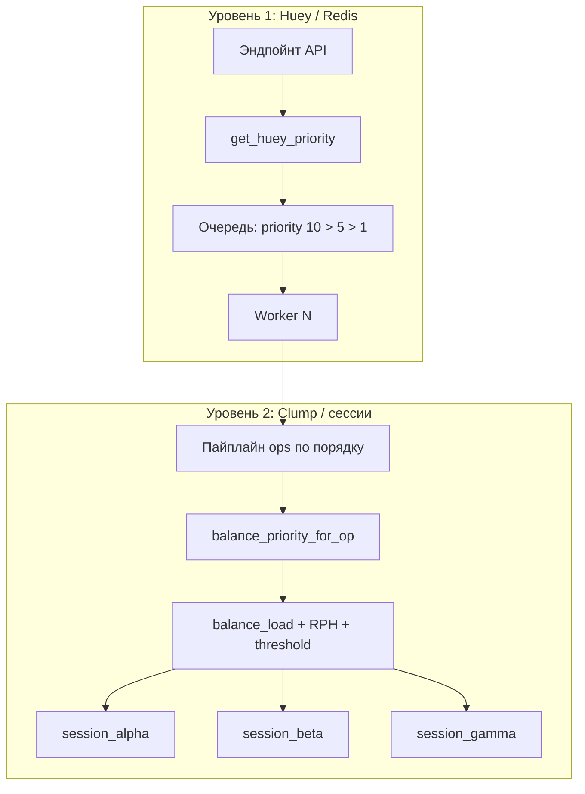
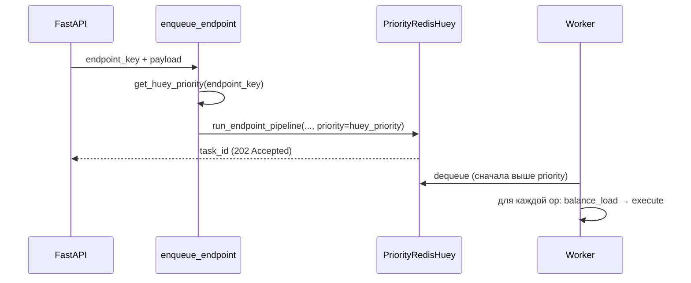

# Архитектура очереди и балансировки (`queue_prot_balance`)

Документ описывает, как устроена очередь задач, приоритеты, работу воркеров Huey и распределение нагрузки по Telegram-сессиям (clump). Основано на текущей реализации в репозитории.

---

## Обзор

Система **двухуровневая**:

1. **Уровень 1 — Huey / Redis** (`PriorityRedisHuey`): порядок выполнения HTTP-запросов (эндпойнтов) воркерами.
2. **Уровень 2 — Clump / сессии** (`MockTelegramClump`): выбор аккаунта (сессии) для каждой Telethon-операции внутри уже взятой воркером задачи.



### Что умеет система

| Возможность | Реализация |
|-------------|------------|
| Приём HTTP-запросов | Mock-эндпойнты в `mock_api.py` |
| Постановка в очередь | `enqueue_endpoint()` в `tasks.py` |
| Одна задача Huey на эндпойнт | `run_endpoint_pipeline` — вся цепочка ops за один dequeue |
| Воркеры | `huey_consumer queue_reg.huey -w N` |
| Балансировка по сессиям | `MockTelegramClump.balance_load()` в `classes.py` |
| Логирование этапов | `ENQUEUE` → `DEQUEUE` → `PIPELINE` / `BALANCE` / `OP` → `DONE` |

> **Примечание:** исполнение Telethon сейчас **моковое** (`mock_execute` — задержка и счётчики RPH). Логика очереди и балансировки рассчитана на подключение реальных вызовов.

---

## Ключевые файлы

| Назначение | Файл |
|------------|------|
| Регистрация Huey, Redis | `queue_reg.py` |
| Постановка и пайплайн задач | `tasks.py` |
| Приоритеты Huey и балансировки | `priorities.py` |
| Каталог ops по эндпойнтам | `ops_catalog.py` |
| Clump, RPH, выбор сессии | `classes.py` |
| Реестр clump (mock) | `clump_registry.py` |
| Mock API | `mock_api.py` |
| FastAPI, health | `main.py` |
| Нагрузочная демонстрация | `demo_load.py` |

---

## Постановка запроса в очередь



### Шаги

1. Эндпойнт идентифицируется **ключом** вида `POST /discovery-api/discover` (строка из словаря `OPS` в `ops_catalog.py`).
2. `get_ops(endpoint_key)` возвращает список Telethon-операций для маршрута.
3. `get_huey_priority(endpoint_key)` задаёт приоритет **очереди Huey**.
4. В Redis ставится **одна** задача:

   ```python
   run_endpoint_pipeline(endpoint_key, payload, huey_priority, priority=huey_priority)
   ```

5. API отвечает **202 Accepted** с `task_id`, `huey_priority`, списком `operations`.

Служебные операции в каталоге, помеченные скобками `(…)`, отфильтровываются в `get_ops()` и в пайплайн не попадают.

---

## Два вида приоритета

Приоритеты **не смешиваются**: числа Huey (10 / 5 / 1) и балансировки (8 / 5 / 3) — разные шкалы и разные цели.

| Уровень | Константы | Где задаётся | Назначение |
|---------|-----------|--------------|------------|
| **Huey** | HIGH=10, NORMAL=5, LOW=1 | По **эндпойнту** | Порядок, в котором **воркеры** забирают задачи из Redis |
| **Balance** | HIGH=8, NORMAL=5, LOW=3 | По **операции** (+ иногда эндпойнт) | Допуск к перегруженной сессии при превышении RPH |

### Приоритет Huey (очередь Redis)

Функция: `get_huey_priority()` в `priorities.py`.

#### HIGH (10)

Эндпойнты из `HIGH_PRIORITY_ENDPOINTS`:

- `POST /discovery-api/add-channel-by-link`
- `POST /discovery-api/add-channel-by-link-session-file`
- `POST /discovery-api/parser/{parser_id}/add-channels`
- `POST /discovery-api/parser/{parser_id}/add-channels?async=true`

#### LOW (1)

Эндпойнты из `LOW_PRIORITY_ENDPOINTS`:

- `POST /discovery-api/discover`
- `POST /discovery-api/discover-groups`

#### NORMAL (5)

Все остальные эндпойнты (auth/qr, parser/start, bot/send-message, stop/delete и т.д.).

### Приоритет балансировки (выбор сессии)

Функция: `balance_priority_for_op(op, endpoint_key)` в `priorities.py`.

| Значение | Условие |
|----------|---------|
| **HIGH (8)** | `op` ∈ `ADD_CHANNEL_OPS` **или** `endpoint_key` ∈ `HIGH_PRIORITY_ENDPOINTS` |
| **LOW (3)** | `op` ∈ `SEARCH_OPS` **или** `endpoint_key` ∈ `LOW_PRIORITY_ENDPOINTS` |
| **NORMAL (5)** | иначе |

**ADD_CHANNEL_OPS:** `get_entity`, `channels.JoinChannel`, `channels.GetFullChannel`, `channels.GetParticipant`, `get_permissions`.

**SEARCH_OPS:** `contacts.Search`, `messages.SearchGlobal`, `get_input_entity`, `channels.GetChannelRecommendations`, `channels.GetFullChannel`, `iter_messages`, `channels.GetParticipants`.

В пайплайне для **каждого** шага вызывается `balance_priority_for_op` и результат передаётся в `clump.execute_op(op, payload, balance_priority)`.

---

## Воркеры и порядок dequeue

### Конфигурация

- Очередь: `PriorityRedisHuey` в `queue_reg.py` (`immediate=False`).
- Запуск: `huey_consumer queue_reg.huey -w N` (число параллельных воркеров).

### Забираются ли задачи с высоким приоритетом первыми?

**Да.** У `PriorityRedisHuey` задачи с **большим** значением `priority` обрабатываются **раньше** задач с меньшим: сначала 10, затем 5, затем 1.

При постановке явно передаётся `priority=huey_priority` в `enqueue_endpoint()`.

Хук `@huey.pre_execute()` в `tasks.py` логирует этап `DEQUEUE` с `huey_priority` и меткой `HIGH` / `NORMAL` / `LOW`.

### Оговорки

- Несколько воркеров (`-w 2+`) могут одновременно выполнять задачи разного приоритета, если высокоприоритетные уже разобраны.
- Внутри **одной** задачи операции выполняются **строго последовательно** по списку из `ops_catalog.py` — без параллелизма по шагам.
- Один HTTP-запрос = **одна** задача в Redis на весь пайплайн эндпойнта (не отдельная задача на каждую op).

### Демонстрация приоритетов

```bash
python demo_load.py --priority-demo
```

Сценарий: 20× `discover` (LOW) + 5× `add-channel` (HIGH). В логах worker задачи add-channel должны появляться раньше discover.

---

## Пайплайн внутри задачи воркера

Задача: `run_endpoint_pipeline` в `tasks.py`.

1. Получить clump: `get_default_clump()`.
2. Получить список ops: `get_ops(endpoint_key)`.
3. Для каждой `op` по порядку:
   - вычислить `balance_priority = balance_priority_for_op(op, endpoint_key)`;
   - `clump.execute_op(op, payload, balance_priority)`;
   - записать результат шага (сессия, нагрузка, ok/fail).
4. Вернуть сводку: `ops_ok`, `distribution`, `results`.

Пример: `POST /discovery-api/discover` — цепочка `connect` → поисковые ops → `disconnect`. Каждый шаг независимо выбирает сессию через балансировщик.

При отказе балансировки шаг помечается `ok=False`, пайплайн **не прерывается** — уменьшается `ops_ok` в итоговой сводке.

---

## Балансировка по сессиям (clump)

### Состав clump

- Несколько парсеров (`MockTelegramparser`) — в mock: `session_alpha`, `session_beta`, `session_gamma`.
- Активные сессии: список `clump.sessions` (можно менять через `add_session` / `remove_session`).

### RPH-лимиты

В `classes.py` задан словарь `rph_limits` по **task_type** (тип нагрузки для лимита), например:

| task_type | Лимит RPH (номинал) |
|-----------|---------------------|
| `messages.SearchGlobal` | 120 |
| `channels.JoinChannel` | 30 |
| `contacts.Search` | 2 |
| `get_entity` | 7 |
| … | см. `classes.py` |

**Эффективный лимит:**

```
effective_limit = rph_limits[task_type] × (1 - reserve)
```

В mock `reserve = 0.1` → используется 90% от номинала.

Счётчик `type_load` — `parser.get_current_request_count(task_type)`; увеличивается при каждом успешном выполнении op на этой сессии.

### Кто считается кандидатом (eligible)

Метод `_is_eligible(parser, request_type, priority)`:

1. Если для `task_type` нет лимита в `rph_limits` — сессия **всегда** eligible.
2. Если `type_load < effective_limit` — eligible.
3. Иначе сессия eligible только если `balance_priority >= threshold_priority`.

В mock **`threshold_priority = 8`** (совпадает с `BALANCE_PRIORITY_HIGH`).

**Смысл:** при перегрузе всех сессий по типу запроса операции с **высоким** приоритетом балансировки (8+) могут «пробить» лимит; операции с **низким** (3) чаще получают отказ.

### Выбор сессии

Среди eligible выбирается парсер с **минимальной** нагрузкой (`balance_load`):

1. Меньше счётчик по **данному** `task_type`.
2. При равенстве — меньше **суммарная** нагрузка по всем типам на аккаунте.
3. При равенстве — лексикографически `session_name` (стабильный tie-break).

Это **least-loaded** распределение между аккаунтами, не round-robin.

### Отказы

| Причина | Поведение |
|---------|-----------|
| Нет активных сессий | `available=False`, `rejected_reason` |
| Все сессии перегружены, priority < 8 | отказ с текстом про превышение RPH |
| Успех | `mock_execute` (в проде — реальный Telethon) |

Балансировка **не перераспределяет** задачи между воркерами Huey — только выбирает сессию **внутри** уже взятой воркером задачи для каждой op.

---

## Маппинг op → task_type

В `priorities.py` словарь `OP_TASK_TYPE` сопоставляет имя операции типу нагрузки для лимитов, например:

- `connect` / `disconnect` → `connect / disconnect`
- `qr_login*` → `QR-авторизация`
- `contacts.Search` → `contacts.Search`

Функция `get_task_type(op)` используется в `execute_op` перед `balance_load`.

---

## Запуск и проверка

### Инфраструктура

```bash
docker run -d --name redis-local -p 6379:6379 redis:7-alpine
huey_consumer queue_reg.huey -w 2
uvicorn main:app --reload --port 8000
```

Переменные Redis: `.env` / `REDIS_HOST`, `REDIS_PORT`, `REDIS_DB`.

### Health

`GET /health` — статус Redis, имя очереди Huey, список сессий clump.

### Нагрузка

```bash
python demo_load.py --count 30
python demo_load.py --priority-demo
```

---

## Краткая шпаргалка

| Вопрос | Ответ |
|--------|--------|
| Задачи с высоким приоритетом первыми? | **Да** (Huey: 10 > 5 > 1) |
| Сколько задач в Redis на один HTTP-запрос? | **Одна** на весь пайплайн эндпойнта |
| Параллельность ops внутри запроса? | **Нет**, только последовательно |
| Балансировка между воркерами? | **Нет**, только между **сессиями** clump |
| Что влияет на выбор аккаунта? | RPH по task_type, reserve 10%, balance_priority vs порог 8, least-loaded |
| Discover vs add-channel под нагрузкой? | Discover: LOW в Huey и на search-ops; add-channel: HIGH в Huey и на критичных ops |

---

## Связанные константы (справочник)

```python
# priorities.py — Huey
HUEY_PRIORITY_HIGH = 10
HUEY_PRIORITY_NORMAL = 5
HUEY_PRIORITY_LOW = 1

# priorities.py — балансировка
BALANCE_PRIORITY_HIGH = 8
BALANCE_PRIORITY_NORMAL = 5
BALANCE_PRIORITY_LOW = 3

# clump_registry.py — порог «пробития» лимита
threshold_priority = 8
reserve = 0.1
```
